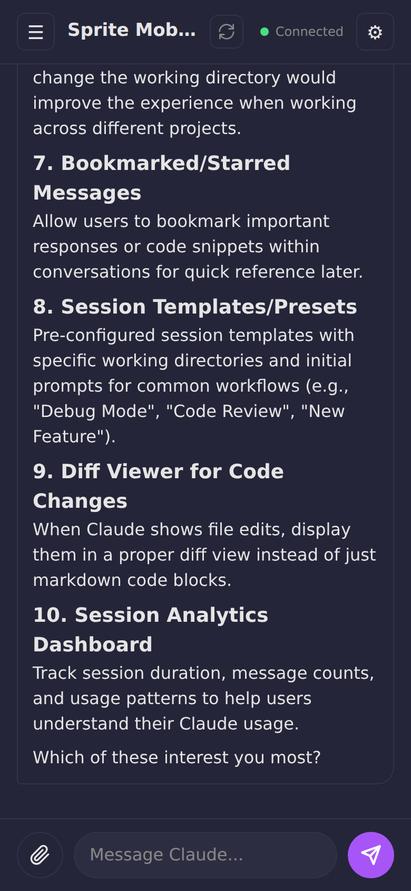
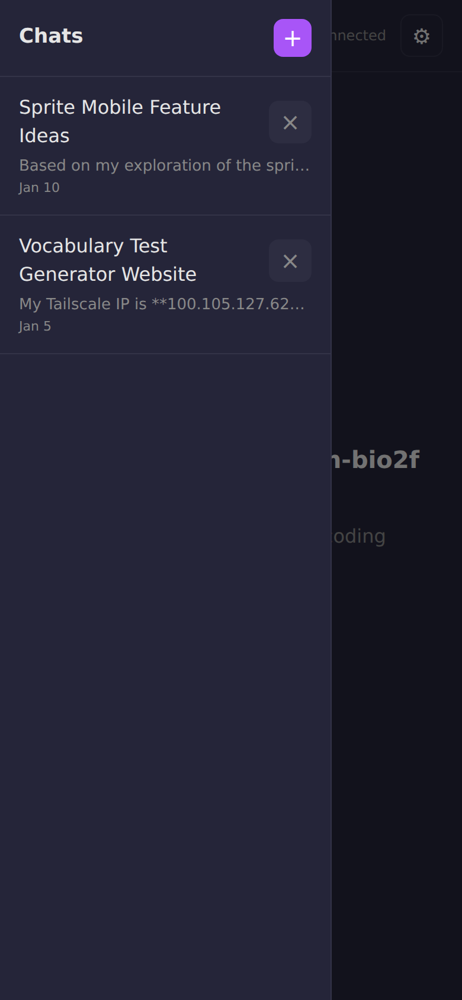

# Sprite Mobile

A mobile-friendly web interface for chatting with Claude Code running on a [Sprite](https://sprites.dev). Supports multiple concurrent chat sessions, image uploads, and persistent message history.

<p>
  
  
</p>

## Prerequisites

This app is designed to run on a Sprite from [sprites.dev](https://sprites.dev). Sprites come with:

- **Bun** runtime pre-installed
- **Claude Code** CLI pre-installed and authenticated

If running elsewhere, you'll need to install these manually and authenticate Claude Code with `claude login`.

## Features

- **Multiple Chat Sessions**: Create and manage multiple independent chat sessions, each with its own Claude Code process
- **Persistent History**: Messages are saved to disk and survive server restarts
- **Session Resume**: Reconnecting to a session resumes the existing Claude conversation
- **Image Support**: Upload and send images to Claude for analysis (auto-resized for API limits)
- **Real-time Streaming**: Responses stream in real-time via WebSocket
- **Activity Indicators**: See exactly what Claude is doing (reading files, running commands, searching)
- **Multi-client Support**: Multiple browser tabs can connect to the same session
- **Auto-naming**: Chat sessions are automatically named based on conversation content
- **Smart Auto-focus**: Input field auto-focuses on desktop after Claude responds (disabled on mobile to avoid keyboard popup)
- **Voice Input**: Tap the microphone button to dictate messages (uses Web Speech API, works on iOS Safari and Android Chrome)
- **Dynamic Branding**: Header displays the sprite's hostname with a neon green 👾
- **Tailscale Integration**: HTTPS access via Tailscale Serve with automatic redirect from public URL
- **Tailnet Gate**: Public URL wakes sprite and redirects to Tailscale URL (if on tailnet)
- **PWA Support**: Installable as a Progressive Web App, works offline (requires HTTPS via Tailscale Serve)
- **Auto-update**: Pulls latest code when the service starts
- **Sprite Network**: Automatic discovery of other sprites in your Fly.io organization via shared Tigris bucket
- **Hot Reloading**: Server code changes take effect immediately without restart
- **Network Restart**: Run `scripts/restart-others.sh` to restart sprite-mobile on all other network sprites after pulling updates

## Access Model

Sprite Mobile uses Tailscale for secure access without passwords or tokens:

```
Public URL (https://sprite.fly.dev)
         │
         ▼
   Tailnet Gate (port 8080)
         │
         ├── On tailnet? ──→ Redirect to Tailscale HTTPS URL
         │
         └── Not on tailnet? ──→ Show "Unauthorized" 👾 🚫
```

**Three access paths:**

| Path | URL | Auth | HTTPS | PWA |
|------|-----|------|-------|-----|
| Public | `https://sprite.fly.dev` | Tailnet Gate | Yes | Redirects |
| Tailscale Serve | `https://sprite.ts.net` | Tailnet only | Yes | Yes |
| Tailscale IP | `http://100.x.x.x:8081` | Tailnet only | No | No |

**Recommended**: Bookmark the public URL. It wakes the sprite and auto-redirects to the Tailscale HTTPS URL when you're on the tailnet.

## Sprite Setup

To set up a fresh Sprite with all dependencies, authentication, and services:

1. First, get your Sprite's public URL (run this from your local machine):
   ```bash
   sprite url update --auth public -s YOUR_SPRITE_NAME
   ```

2. Then, on the Sprite, download and run the setup script:
   ```bash
   curl -fsSL https://gist.githubusercontent.com/clouvet/901dabc09e62648fa394af65ad004d04/raw/sprite-setup.sh -o sprite-setup.sh && chmod +x sprite-setup.sh && ./sprite-setup.sh
   ```

The script will:
1. Configure hostname and git user
2. Authenticate Claude CLI, GitHub CLI, Fly.io CLI, Sprites CLI
3. Set up Sprite Network credentials (optional - enables automatic discovery of other sprites in your org)
4. Install and configure Tailscale
5. Clone and run sprite-mobile
6. Set up Tailscale Serve (HTTPS for PWA support) and restart sprite-mobile to register with the network
7. Start the Tailnet Gate (public entry point)

The script is idempotent and can be safely re-run. It supports both old (`curl-sprite-api`) and new (`sprite-env`) sprite API commands.

The app is installed to `~/.sprite-mobile` (hidden directory). On each service start, it attempts to auto-update via `git pull` so all sprites receive updates when they wake up.

**Note:** During authentication:
- Claude CLI may start a new Claude session after completing. Just type `exit` or press `Ctrl+C` to exit and continue.
- Sprites CLI will prompt you to create a new sprite. After creating it, exit the sprite console to continue with setup.

## Sprite Orchestration

Once you have one sprite-mobile sprite set up, it can automatically create and configure new sprites with no manual intervention. This is useful for scaling your sprite fleet or letting Claude Code create new sprites on demand.

### Configuration Management

The setup script manages all authentication tokens and environment variables through `~/.sprite-config`. This file:

- **Single source of truth** - All environment variables in one place
- **Shell-agnostic** - Both bash and zsh source it automatically
- **Simple format** - Easy-to-edit key=value pairs
- **Portable** - Copy between sprites for easy setup replication

**To replicate a sprite's configuration:**

```bash
# On the source sprite
scp ~/.sprite-config new-sprite:~/.sprite-config

# On the new sprite, the setup script will use it automatically
./sprite-setup.sh all
```

### One-Time Setup: Tailscale Reusable Auth Key

For fully automated setup, you need a Tailscale reusable auth key. During first-time setup (step 7), choose option 2 and follow the prompts to create one. The key is saved and included in config exports.

Alternatively, create one manually:
1. Go to https://login.tailscale.com/admin/settings/keys
2. Click "Generate auth key"
3. Check "Reusable"
4. Save the key to `~/.sprite-mobile/.tailscale-auth-key`

### Creating a New Sprite from an Existing One

From your existing sprite-mobile sprite:

```bash
# Set the new sprite's name
NEW_SPRITE="my-new-sprite"

# 1. Create the sprite
sprite create $NEW_SPRITE

# 2. Make its URL public
sprite url update --auth public -s $NEW_SPRITE

# 3. Export config and run setup on the new sprite
~/.sprite-mobile/sprite-setup.sh --export | \
  sprite -s $NEW_SPRITE exec bash -c "
    curl -fsSL https://raw.githubusercontent.com/superfly/sprite-mobile/main/sprite-setup.sh -o ~/sprite-setup.sh
    chmod +x ~/sprite-setup.sh
    ~/sprite-setup.sh --config - --name $NEW_SPRITE all
  "
```

### What Gets Transferred

The exported config includes:
- Git configuration (user.name, user.email)
- Claude CLI credentials
- GitHub CLI credentials
- Fly.io CLI credentials
- Sprite Network credentials (if configured)
- Tailscale reusable auth key (if configured)
- Port settings

The following are **not** transferred (they're unique per sprite):
- Hostname (set via `--name`)
- Public URL (derived from name or set via `--url`)

### Setup Script Options

```bash
# Export current sprite's config
sprite-setup.sh --export > config.json

# Run non-interactively with config file
sprite-setup.sh --config config.json all

# Run with explicit name/URL for new sprite
sprite-setup.sh --config config.json --name my-sprite --url https://my-sprite.fly.dev all

# Read config from stdin
cat config.json | sprite-setup.sh --config - --name my-sprite all

# Run specific steps only
sprite-setup.sh --config config.json --name my-sprite 1-4 8 11
```

### Letting Claude Create Sprites

With orchestration configured, you can simply tell Claude Code:

> "Create a new sprite-mobile sprite called test-sprite"

Claude will handle the entire process automatically using the commands above.

## Quick Start

If you prefer to set things up manually:

```bash
git clone <repo-url> sprite-mobile
cd sprite-mobile
bun install
bun start
```

The server runs on port 8081 by default. Override with the `PORT` environment variable.

Open `http://localhost:8081` in a browser to access the chat interface.

## Environment Variables

### Configuration File

All environment variables are managed through `~/.sprite-config`, which serves as the single source of truth. Both bash and zsh automatically source this file.

**Format:**
```bash
# ~/.sprite-config
GH_TOKEN=ghp_xxxxx
CLAUDE_CODE_OAUTH_TOKEN=sk-ant-oat01-xxxxx
FLY_API_TOKEN=FlyV1 xxxxx
SPRITE_API_TOKEN=cl-sprites/org/id/token
SPRITE_PUBLIC_URL=https://my-sprite.fly.dev
TAILSCALE_SERVE_URL=https://my-sprite.tailxxxxx.ts.net
SPRITE_MOBILE_REPO=https://github.com/org/sprite-mobile
```

### Key Variables

| Variable | Description | Example |
|----------|-------------|---------|
| `PORT` | Server port | `8081` |
| `SPRITE_PUBLIC_URL` | Public URL for waking sprite | `https://my-sprite.fly.dev` |
| `TAILSCALE_SERVE_URL` | Tailscale HTTPS URL | `https://my-sprite.ts.net` |
| `SPRITE_HOSTNAME` | Hostname for sprite network registration | `my-sprite` |
| `SPRITE_NETWORK_CREDS` | Path to Tigris credentials file | `~/.sprite-network/credentials.json` |
| `SPRITE_NETWORK_ORG` | Fly.io org for sprite network | `my-org` |
| `GH_TOKEN` | GitHub Personal Access Token | `ghp_xxxxx` |
| `CLAUDE_CODE_OAUTH_TOKEN` | Claude Code OAuth token | `sk-ant-oat01-xxxxx` |
| `FLY_API_TOKEN` | Fly.io API token | `FlyV1 xxxxx` |
| `SPRITE_API_TOKEN` | Sprite CLI API token | `cl-sprites/org/id/token` |

These are automatically configured by the setup script and stored in `~/.sprite-config`.

## Architecture

### Services

After setup, these services run on your sprite:

| Service | Port | Description |
|---------|------|-------------|
| `tailnet-gate` | 8080 | Public entry point, redirects to Tailscale URL |
| `sprite-mobile` | 8081 | Main app server |
| `tailscaled` | - | Tailscale daemon |

### Data Storage

All data is stored in the `data/` directory:

- `sessions.json` - Chat session metadata
- `sprites.json` - Saved Sprite profiles
- `messages/{sessionId}.json` - Message history per session
- `uploads/{sessionId}/` - Uploaded images per session

### API Endpoints

| Method | Endpoint | Description |
|--------|----------|-------------|
| GET | `/api/config` | Get public configuration |
| GET | `/api/sessions` | List all sessions |
| POST | `/api/sessions` | Create new session |
| PATCH | `/api/sessions/:id` | Update session name/cwd |
| DELETE | `/api/sessions/:id` | Delete session |
| GET | `/api/sessions/:id/messages` | Get message history |
| POST | `/api/sessions/:id/regenerate-title` | Regenerate session title |
| POST | `/api/upload?session={id}` | Upload an image |
| GET | `/api/uploads/:sessionId/:filename` | Retrieve uploaded image |
| GET | `/api/sprites` | List saved Sprite profiles |
| POST | `/api/sprites` | Add a Sprite profile |
| DELETE | `/api/sprites/:id` | Remove a Sprite profile |
| GET | `/api/network/status` | Check if sprite network is configured |
| GET | `/api/network/sprites` | Discover sprites in the network |
| POST | `/api/network/heartbeat` | Manual heartbeat trigger |

### WebSocket

Connect to `/ws?session={sessionId}` to interact with a chat session.

**Incoming messages (from server):**
- `{ type: "history", messages: [...] }` - Message history on connect
- `{ type: "assistant", message: {...} }` - Streaming assistant response
- `{ type: "result", ... }` - Response complete
- `{ type: "user_message", message: {...} }` - User message from another client
- `{ type: "processing", isProcessing: true/false }` - Processing state
- `{ type: "refresh_sessions" }` - Session list changed
- `{ type: "system", message: "..." }` - System notifications

**Outgoing messages (to server):**
```json
{
  "type": "user",
  "content": "Your message here",
  "imageId": "optional-image-id",
  "imageFilename": "optional-filename",
  "imageMediaType": "image/png"
}
```

### Keepalive

A separate WebSocket endpoint at `/ws/keepalive` keeps the Sprite awake while the app is open.

## Session Lifecycle

1. **Creation**: `POST /api/sessions` creates a new session with a working directory
2. **Connection**: WebSocket connection spawns a Claude Code process
3. **Messaging**: Messages are saved and streamed in real-time
4. **Disconnection**: Claude process continues running for 30 minutes
5. **Reconnection**: Rejoins the existing process if still alive, otherwise resumes via Claude's session ID
6. **Cleanup**: Idle processes with no clients are terminated after 30 minutes

## Configuration

Sessions can specify a working directory (`cwd`) that Claude Code operates in. This defaults to the user's home directory.

## Security

### Access Control

Access is controlled via Tailscale:
- **Tailnet membership is the auth** - No passwords or tokens needed
- **Public URL only redirects** - The tailnet gate checks if you can reach the Tailscale URL before redirecting
- **Not on tailnet = Unauthorized** - Users outside your tailnet see a blocked page

### Claude Code Permissions

This app runs Claude Code with `--dangerously-skip-permissions`, which allows Claude to execute commands without confirmation prompts. This is appropriate for a Sprite environment where the sandbox provides isolation, but be aware that Claude has full access to the Sprite's filesystem and can run arbitrary commands.

## Troubleshooting

### Chrome Certificate Error

If Chrome shows `ERR_CERTIFICATE_TRANSPARENCY_REQUIRED` when accessing the Tailscale URL:
- Wait a few minutes for certificate propagation
- Try hard refresh (Cmd+Shift+R)
- Clear site data in DevTools
- Try incognito mode
- Safari is more lenient and may work immediately

### Tailscale Serve Not Working

Check the serve status:
```bash
tailscale serve status
```

Restart if needed:
```bash
tailscale serve --bg 8081
```
