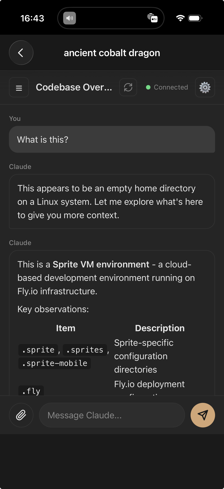

# Sprite Mobile

A mobile-friendly web interface for chatting with Claude Code running on a [Sprite](https://sprites.dev). Supports multiple concurrent chat sessions, image uploads, and persistent message history.



## Prerequisites

This app is designed to run on a Sprite from [sprites.dev](https://sprites.dev). Sprites come with:

- **Bun** runtime pre-installed
- **Claude Code** CLI pre-installed and authenticated

If running elsewhere, you'll need to install these manually and authenticate Claude Code with `claude login`.

## Features

- **Multiple Chat Sessions**: Create and manage multiple independent chat sessions, each with its own Claude Code process
- **Persistent History**: Messages are saved to disk and survive server restarts
- **Session Resume**: Reconnecting to a session resumes the existing Claude conversation
- **Image Support**: Upload and send images to Claude for analysis
- **Real-time Streaming**: Responses stream in real-time via WebSocket
- **Multi-client Support**: Multiple browser tabs can connect to the same session
- **Auto-naming**: Chat sessions are automatically named based on the first message
- **Sprite Profiles**: Save connections to other Sprite instances

## Sprite Setup

To set up a fresh Sprite with all dependencies, authentication, and services:

1. First, get your Sprite's public URL (run this from your local machine):
   ```bash
   sprite url update --auth public -s YOUR_SPRITE_NAME
   ```

2. Then, on the Sprite, download and run the setup script:
   ```bash
   curl -fsSL https://gist.githubusercontent.com/clouvet/901dabc09e62648fa394af65ad004d04/raw/sprite-setup.sh -o sprite-setup.sh && chmod +x sprite-setup.sh && ./sprite-setup.sh
   ```

The script will prompt for the public URL and configure hostname, git, Claude CLI, GitHub CLI, Fly.io, Tailscale, and start the required services. The script is idempotent and can be safely re-run. It supports both old (`curl-sprite-api`) and new (`sprite-env`) sprite API commands.

The app is installed to `~/.sprite-mobile` (hidden directory). On each service start, it attempts to auto-update via `git pull` so all sprites receive updates when they wake up.

**Note:** During authentication:
- Claude CLI may start a new Claude session after completing. Just type `exit` or press `Ctrl+C` to exit and continue.
- Sprites CLI will prompt you to create a new sprite. After creating it, exit the sprite console to continue with setup.

## Quick Start

If you prefer to set things up manually:

```bash
git clone <repo-url> sprite-mobile
cd sprite-mobile
bun start
```

The server runs on port 8081 by default. Override with the `PORT` environment variable.

Open `http://localhost:8081` in a browser to access the chat interface.

## Architecture

### Data Storage

All data is stored in the `data/` directory:

- `sessions.json` - Chat session metadata
- `sprites.json` - Saved Sprite profiles
- `messages/{sessionId}.json` - Message history per session
- `uploads/{sessionId}/` - Uploaded images per session

### API Endpoints

| Method | Endpoint | Description |
|--------|----------|-------------|
| GET | `/api/sessions` | List all sessions |
| POST | `/api/sessions` | Create new session |
| PATCH | `/api/sessions/:id` | Update session name/cwd |
| DELETE | `/api/sessions/:id` | Delete session |
| GET | `/api/sessions/:id/messages` | Get message history |
| POST | `/api/sessions/:id/regenerate-title` | Regenerate session title |
| POST | `/api/upload?session={id}` | Upload an image |
| GET | `/api/uploads/:sessionId/:filename` | Retrieve uploaded image |
| GET | `/api/sprites` | List saved Sprite profiles |
| POST | `/api/sprites` | Add a Sprite profile |
| DELETE | `/api/sprites/:id` | Remove a Sprite profile |

### WebSocket

Connect to `/ws?session={sessionId}` to interact with a chat session.

**Incoming messages (from server):**
- `{ type: "history", messages: [...] }` - Message history on connect
- `{ type: "assistant", message: {...} }` - Streaming assistant response
- `{ type: "result", ... }` - Response complete
- `{ type: "user_message", message: {...} }` - User message from another client
- `{ type: "processing", isProcessing: true/false }` - Processing state
- `{ type: "refresh_sessions" }` - Session list changed
- `{ type: "system", message: "..." }` - System notifications

**Outgoing messages (to server):**
```json
{
  "type": "user",
  "content": "Your message here",
  "imageId": "optional-image-id",
  "imageFilename": "optional-filename",
  "imageMediaType": "image/png"
}
```

### Keepalive

A separate WebSocket endpoint at `/ws/keepalive` keeps the Sprite awake while the app is open.

## Session Lifecycle

1. **Creation**: `POST /api/sessions` creates a new session with a working directory
2. **Connection**: WebSocket connection spawns a Claude Code process
3. **Messaging**: Messages are saved and streamed in real-time
4. **Disconnection**: Claude process continues running for 30 minutes
5. **Reconnection**: Rejoins the existing process if still alive, otherwise resumes via Claude's session ID
6. **Cleanup**: Idle processes with no clients are terminated after 30 minutes

## Configuration

Sessions can specify a working directory (`cwd`) that Claude Code operates in. This defaults to the user's home directory.

### Keepalive Setup

To prevent your Sprite from sleeping while the app is open, configure the public URL keepalive:

1. Create a `.env` file with your Sprite's public URL:
```bash
echo 'SPRITE_PUBLIC_URL=https://your-sprite.sprites.app' > /home/sprite/.sprite-mobile/.env
```

2. Restart the service to pick up the change:
```bash
# New sprites:
sprite-env curl -X POST /v1/services/signal -d '{"name": "sprite-mobile", "signal": "SIGTERM"}'
# Older sprites:
curl-sprite-api -X POST /v1/services/signal -d '{"name": "sprite-mobile", "signal": "SIGTERM"}'
```

The client will now ping your Sprite's public URL every 30 seconds while the app is open, keeping it awake.

## Security Note

This app runs Claude Code with `--dangerously-skip-permissions`, which allows Claude to execute commands without confirmation prompts. This is appropriate for a Sprite environment where the sandbox provides isolation, but be aware that Claude has full access to the Sprite's filesystem and can run arbitrary commands.

## iOS App

The `ios/` directory contains a native iOS wrapper app that provides a more native mobile experience. See [ios/README.md](ios/README.md) for build instructions.
